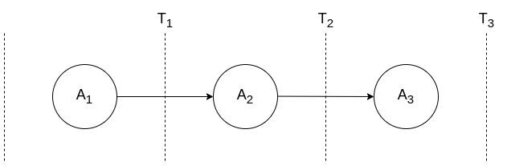
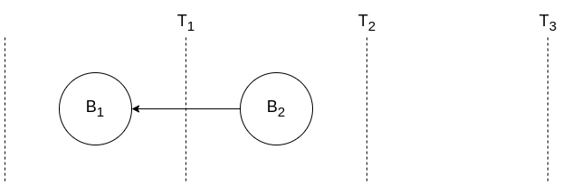
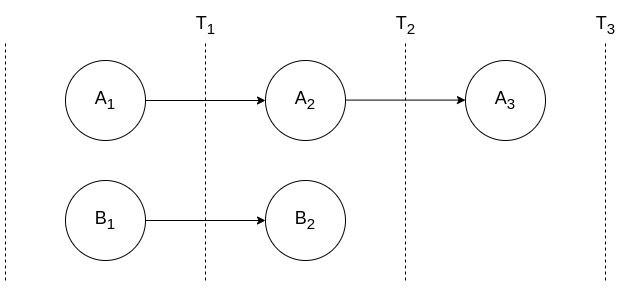
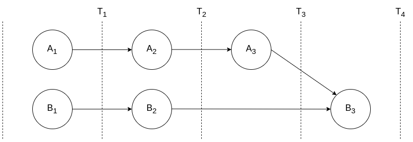
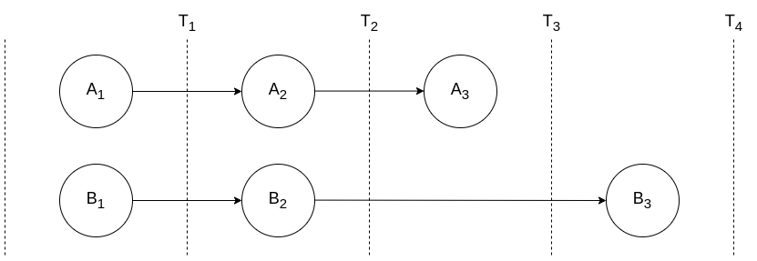
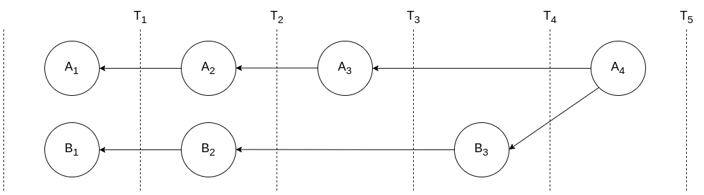

# Operations Log

The operations log or oplog, contains an immutable list of operations which have been carried out on the database.

Each operation is known as an entry and each entry includes the id of the log the entry is stored in, some metadata describing the entry, references to other entries which come before it and payload which includes the data being stored.

## Conflict-free Replicated Data Types (CRDT)

in a distributed system such as orbitdb, a log is replicated across multiple systems. these replicas are updated independently of one another so that the state of one replica may differ greatly from the state of another. Differing replicas leaves the state of the log inconsistent. Concurrent updates to multiple versions of the same log requires a mechanism for resolving inconsistencies and returning the log to a consistent state across all replicas.  

a crdt is a data structure that is replicated across multiple systems, is able to be updated concurrently and without any coordination with other replicas and can resolve inconsistencies between replicas when replicas are merged.

## Joining Logs

Logs are stored independently of one another, hence they are decentralized. If two logs store the data for the same database, they must eventually be joined together.

Each log contains one or more entries. The latest entry in the log is known as the head. When one log is merged into another log ("log joining"), the head of each log is referenced, resulting in a log having multiple heads.   

### An example

Two logs, A and B, store entries for some database, "my-db". A resides on one computer, and B on another.

Entries are added to log A:

```
logA.append('A1')
logA.append('A2')
logA.append('A3')
```

Graphically, this can be represented as:



Each circle is a new log entry and the vertical line "T" represents the time the entry is added. "A3" represents log A's head entry.

Adding entries to log B:

```
logB.append('B1')
logB.append('B2')
```

Again, graphically, this may look something like:



For log B, head is "B2".

Both logs A and B are managed separately but, because they both store entries for database my-db, at some point they need to merged. Logs are merged using the `join` function. To merge logA into logB, the `join` function is called on logB:

```
logB.join(logA)
```

On B, two parallel log histories are stored:



Note that log B now has two heads, "A3" and "B2".

Also note that log A remains unchanged. This is because logB has not been merged into logA:


Adding a new record results in log B having a single head, B3:

```
logB.join('B3')
```



Log A remains unchanged.

Merging B into A is the same as merging A into B:

```
logA.join(logB)
```

Calling join on logA results in the following:



Log A's heads are "A3" and "B3".

Finally, adding a new record to A:

```
logA.append('A4')
```

results in:



with log A's single head referencing "A4".

## Entry retrieval

Entries can be retrieved by iterating over the oplog.

```
for await (const entry from log.iterator()) {
  console.log(entry)
}
```

A subset of entries can also be retrieved by passing filters to the iterator. Available options include:

**amount:** only return a certain number of entries. By default, all entries are returned.

**gt:** return all entries after entry with specified hash (exclusive)

**gte:** return all entries after entry with specified hash (inclusive),

**lt:**  return all entries before entry with specified hash (exclusive),

**lte:** return all entries before entry with specified hash (inclusive).

For example, the last 5 entries can be retrieved by passing the amount parameter:

```
log.iterator({ amount: 5 })
```

If the log contains less than 5 entries, all entries will be returned.

Additionally, multiple parameters can be used. To retrieve 2 entries prior to a an entry with hash '123', use amount and lt:

```
log.iterator({ amount: 2, lt: '123' })
```

"Before" and "after" are determined by the order in which the entries are sorted. By default, entries are sorted newest to oldest.

## Entry sorting and conflict resolution

OpLog relies on a sort function to determine the order in which entries are returned. By default, Oplog uses the sort function Last Write Wins, which uses a logical clock to determine whether one entry is "newer" than another one.  

Sorting can be customized by passing an alternative function:

```javaScript
const CustomSortFn = () => {
  // alternative sorting mechanism.
}

const identity = Identities.createIdentity('userA')
const db = await Log(identity, { sortFn: CustomSortFn })
```

See Conflict Resolution for more information about creating a custom sort function.

When a log contains a single history, the order of entries can be easily determined by a simple incremental counter. However, when two or more logs are joined, conflicts can occur between entries. When conflicts arise, a clock is used to resolve them.

### Ordering decentralized logs

In a centralized database, entries are stored in a single table. This allows for the order of entries to be easily determined, either by assigning a sequentially incremental number (E.g. 1, 2, 3, etc) or timestamp (E.g. 1681199558, 2023-01-01 23:11:56, etc).

In a decentalized database, multiple versions of a database may be running across various locations, and may not always be connected all of the time. While some kind of sequential identifier can be used for entries within a standalone database, problems arise if entries from distributed copies of the database are joined together.

Because of the adhoc nature of a connection between databases, a number of issues can arise:

- Databases are not always connected, and may be offline for long periods of time,
- The various systems running the database may not share the exact same time,
- It is possible for two entries in to different databases to be written at exactly the same time.

This means the traditional sequential or temporal id cannot guarantee a single order of entries across multiple copies of the database. Hence, this problem is solved through the use of a logical clock.

### Logical Clock

A logical clock provides a method to timestamp entries without needing to know the current state of a clock on another system.

A logical clock contains two properties; a unique hash to distinguish the clock from other clocks and a logical "time". As each new entry is added, the time is incremented. Both properties allow entries to be sorted, because, if there is a "time" clash (I.e. both items have the same "time"), the ordering can fall back to the hash as a final attempt at collision resolution.

### Last Write Wins

Imagine there are two logs, A and B which share entries (I.e. they represent the operations of the same database).

Log A has a logical clock initialized with the hash "1". Log B has a logical clock initialized with the hash "2". Both clocks are initialized with time equal to "0".

Entries are added to A:

```
A.append('A1') // Time: 1
A.append('A2') // Time: 2
A.append('A3') // Time: 3
```

At the same time, entries are added to B:

```
B.append('B1') // Time: 1
B.append('B2') // Time: 2
```

Log A is joined to log B.

Iterating over the entries in log B will yield A1, B1, A2, B2, A3. The order is determined by the sort function, which, by default, is Last Write Wins (LWW). The LWW function will determine that an entry with a great time will come after the entry with a lesser time. Therefore, B2 follows B1 and A3 follows both A2 and A1. And, the clock's hash will determine the order for entries with the same logical time. Therefore B1 follows A1 and B2 follows A2.

Joining Log B to log A should yield the same results because the sort function is the same for both logs. This ensures the ordering of the log entries is deterministic, and, thus, the same across databases.  