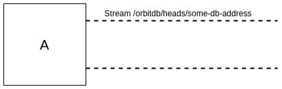
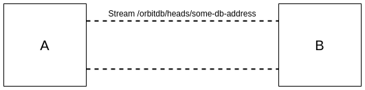
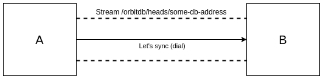
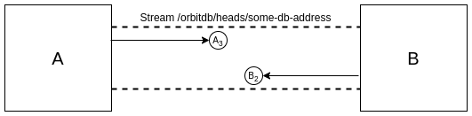
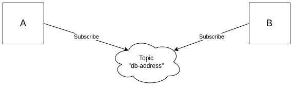
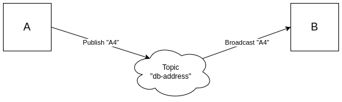
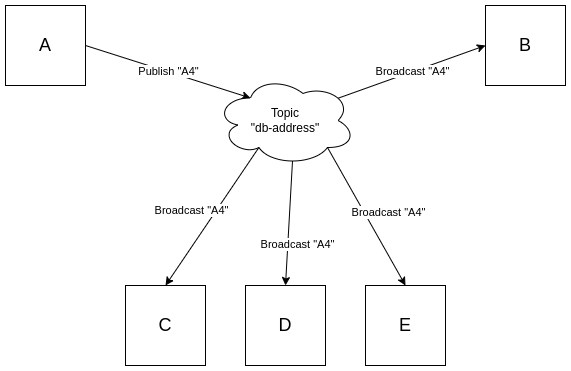

# Sync

Multiple peers can update their copy of a "shared" database by joining oplogs (see [OpLogs](./oplog.md)). Peers need to make each other aware of their local database copies and swap entries with one another until all peers have the same copy of the database. This process is known as database synchronization.

There are two parts to sync-ing;

1) A peer needs to sync its current state with other peers when the peers first connect, 

and,

2) If a peer adds an operation to the database, it must make other peers aware of the change.

In OrbitDB, oplog entries are linked in order of creation, so only the latest entry (the head) needs to be swapped.

## The initial sync

The sychronization process between two peers begins with each peer making the other aware of its current local heads.

### Listening for other peers

When a peer starts, it must "listen" for the connection of other peers so that, upon connection, the peers can swap their current state. To do this, a peer initiates a "stream handler" which handles to transfer of heads between both peers. 

The stream handler is made up of two parts; a protocol name which uniquely identifies the common stream, and the stream itself, which facilities a two way transfer of heads between peers. The protocol is simply a string with the format `/orbitdb/heads/[db-address]` where "db-address" is the hash of the database being synchronized.

 Peer A opens a stream handler for communicating entry heads.

When another peer starts, it will run through the same "listening" process.

 Peer B opens a stream handler, triggering a a "initial" sync.

### Synchronizing for the first time

The local peer is now set up to know when another, remote peer wants to swap database heads. When the remote peer connects, the local peer "dials" the remote peer and current heads are swapped using the above stream.

 The connection of peer B triggers peer A's dial process.

 Peer A sends its heads to Peer B and Peer B sends its heads to Peer A.

## Ongoing synchronization

Once the current database heads of both A and B have been swapped, both peers can "listen" for additional changes using libp2p's pubsub protocol.

Peers are made aware of changes to a shared database by subscribing to a pubsub topic which uses the address of the database for the topic's name.

 Peer A and B subscribe to the same database updates.

If a write occurs on Peer A, it will notify Peer B of the change by "publishing" it. Because Peer B has "subscribed" to any changes made to the shared database, it will update its own copy of the database with the new additions. Alternatively, if a write is made on Peer B, Peer A will use the same "publish"/"subscribe" mechanism to update its own copy of the database.

 Peer A writes a new record "A4" which is broadcast to Peer B via the topic "db-address".

 If additional peers have subscribed, they will also receive updates to peer A's heads.